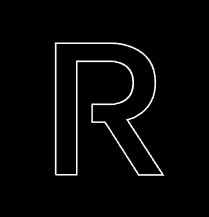

# RAZZ E-Commerce - Backend

<br/>

<div align="center">
	

[](https://www.npmjs.com/package/express)
[](https://www.npmjs.com/package/sequelize)
[](https://www.npmjs.com/package/mysql)
[](https://www.npmjs.com/package/jsonwebtoken)
[](https://www.npmjs.com/package/bcrypt)
[](https://www.npmjs.com/package/cors)
[](https://www.npmjs.com/package/multer)
[](https://www.npmjs.com/package/midtrans-client)
[](https://www.npmjs.com/package/dayjs)
[](https://www.npmjs.com/package/nodemailer)

<br/>

</div>

<br/>

Razz E-Commerce is a platform for buying and selling various products, where this platform can make it easier for customers and sellers to transact with each other

## Contents

- [API Endpoint](#api-endpoint)
- [Run Application](#run-application)
- [Deployment](#deployment)
- [Related Projects](#related-projects)
- [Contributors](#contributors)

## API Endpoint

### Public

- Login
- Register
- Forgot Password
- Search Product
- Product detail

### Customer:

- Payment
- History Payment 

### Seller:

- Add Product
- Edit Product

## How to Run the Application

### 1. Clone this repository

Clone this repository by run the following code:

```
$ git clone <this-repo-url>
```

### 2. Install dependency packages

Install dependency packages by run the following code inside project folder:

```
$ npm install
```

### 3. Run `npm start`

Runs the app in the development mode.\
Open [http://localhost:8000](http://localhost:8000) to view it in your browser.

The page will reload when you make changes.\
You may also see any lint errors in the console.

## Deployment

<https://vehicle-rental-be.herokuapp.com/>

## Related Projects

`RAZZ E-COMMERCE  - Frontend` <https://github.com/fahrul-muhammad/raz-front-end>

## Contributors

This project created with ReactJS by [Muhammad Iqbal Firdaus](https://github.com/mahendraiqbal), [Fahrul Muhammad](https://github.com/fahrul-muhammad), [Tri Sumanzaya](https://github.com/Trisumanzaya93), [Rahma sya'bani](https://github.com/rahmasbn), [Hazpi Nurafgan](https://github.com/Hazgn).


